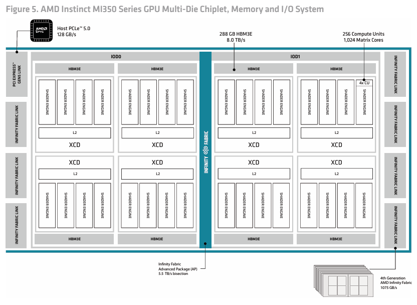
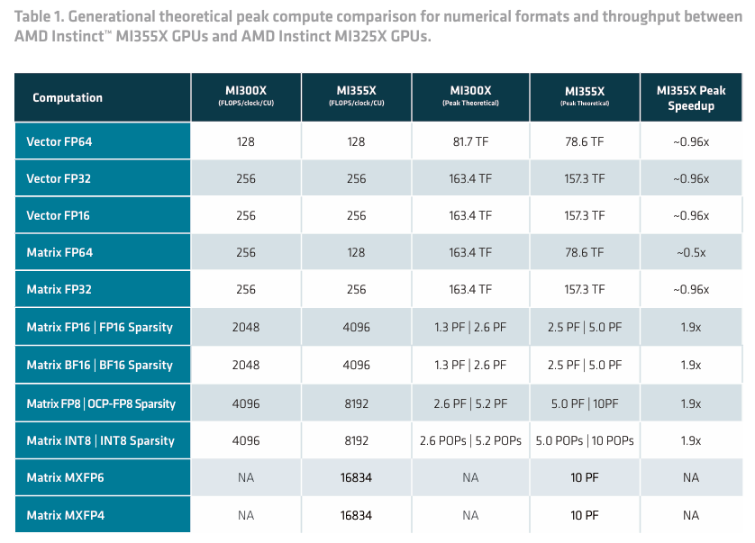
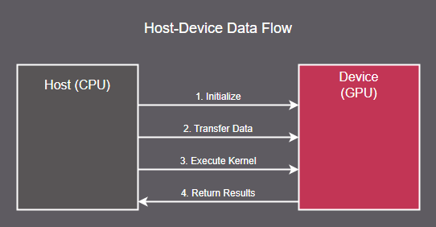
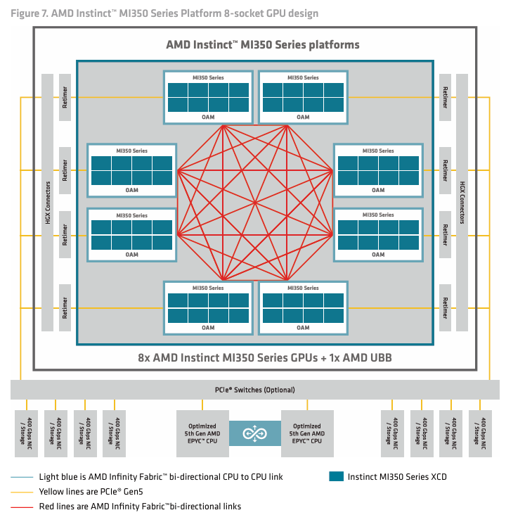
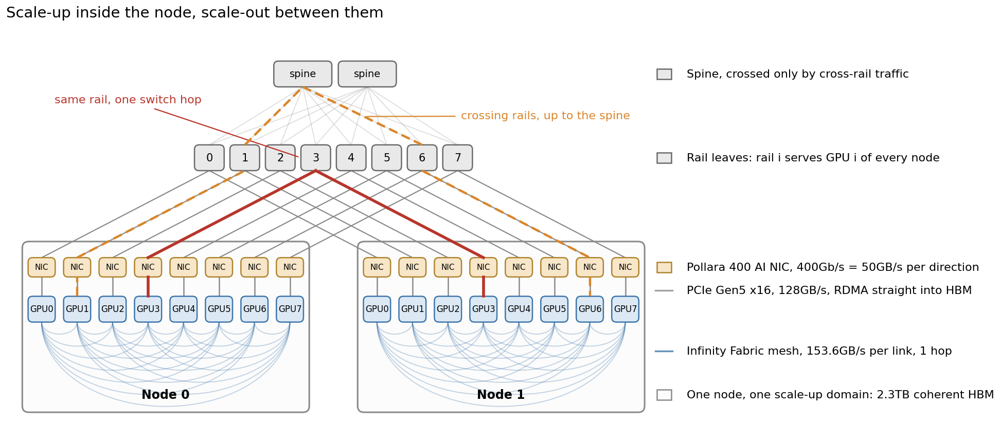

# Prerequisites

Before starting this section, it would be beneficial to familiarize yourself with the basics of GPU programming and architecture through the many wonderful and abundant resources already out there. Many resources likely detail the NVIDIA/CUDA model, upon which this section will build upon and tailor towards AMD's CDNA architecture (specifically CNDA4, MI355X).

If you're looking for a place to start, I would recommend the following:
- [Excellent explanation of the essence of the GPU (CUDA) programming model](https://youtu.be/QQceTDjA4f4?si=r-JQopWAMU0TlwcV)
- [Cornell GPU architecture workshop](https://cvw.cac.cornell.edu/gpu-architecture)
- [The HIP programming model](https://rocm.docs.amd.com/projects/HIP/en/docs-6.4.2/understand/programming_model.html)
- Many youtube resources for visual explanations.

---

# CUDA to ROCm

Assuming you've built your knowledge base on CUDA, here is a quick mapping of confusing terms between the two sides:

| CUDA | ROCm | Concept |
| --- | --- | --- |
| CUDA | HIP | |
| Thread | Thread | |
| Warp | Wavefront | |
| Block | Workgroup | |
| Warp size (32) | Wavefront size (64) | |
| CUDA core | SIMD lane | |
| Streaming Multiprocessor (SM) | Compute Unit (CU) | |
| Graphics Processing Cluster (GPC) | Shader Engine (SE) | |
| Tensor Core | Matrix Core | |
| Shared memory | LDS (Local Data Share) | |
| Local memory | Scratch / private memory | |
| NVLink | Infinity Fabric | |

---

# CDNA Architecture

Nvidia and AMD both offer a family of GPUs tailored towards HPC/AI application (ie. outside of the consumer RTX/RADEON lineups). If you are familiar with the A100, H100, H200 series from NVIDIA, the AMD equivalent of these are the MI250, MI300 and MI350 respectively. These form the CDNA architecture series.

Here is a look inside the MI350:



There may be a few unfamiliar terms here such as XCD or Shader Engine (SE). Most commonly we think in terms of SMs or CUs, and leave higher abstraction levels as a hardware implementation detail. This is fine for understanding the GPU programming model, however it is still good to keep a top level view of the hardware, especially when discussing topology or cache behaviour.

It may help to understand this with the following hierarchy:

```
GPU Package
├─ IODs (I/O Dies: interconnect + memory controllers)
├─ HBM
└─ XCD (Accelerator Compute Die)
    ├─ L2 Cache
    └─ SE (Shader Engine)
        └─ CU (Compute Unit)
            ├─ Scalar Unit
            ├─ 4 × SIMD
            ├─ Matrix Core (MFMA / AI Engine)
            └─ Wavefront
                └─ 64 × Thread
```

For HPC/AI workloads, we are most interested in the Matrix Core.

CDNA4 Matrix Cores introduced instruction and hardware support for micro-scaling formats such as MXFP8, MXFP6 and MXFP4. A more detailed explanation on micro-scaling formats on ROCm can be found [here](https://rocm.blogs.amd.com/artificial-intelligence/mxfp-t2i-t2v/README.html). You can also read the original paper on [Microscaling Data Formats for Deep Learning](https://arxiv.org/abs/2310.10537)

Essentially, these formats store using lower-precision formats with an associated scaling factor (8-bit E8M0), taking the compute and memory advantages of low-bit quantization whilst attempting to preserve much of the dynamic range.

This expands the set of natively supported datatypes:



However, despite the enormous compute capability at our disposal, we are often limited by our HBM bandwidth. 

For example, our peak compute with BF16 is 2.3 PFLOP/s. With a peak HBM bandwidth of 8TB/s, we would need to perform roughly 288 FLOPs per byte loaded from HBM to fully saturate the Matrix Cores. As a result, achieving peak compute performance depends heavily on data reuse through registers, LDS, L2 cache, and matrix tiling.

---

# Host-Device Heterogeneous Systems

At heart, the GPU is simply an accelerator used to offload parallelised workloads. The host (CPU) still needs to orchestrate the program flow by offloading the correct operations to the GPU, at the right time and with the right data.



In a typical GPU server system, PCIe is the primary host-device communication link (like what you'd find on a consumer desktop build!)

---

# Node Architecture and Topology

When scaling GPU systems, we naturally need to think about device-to-device communication. A modern multi-GPU node is commonly organised as 8 GPUs in a full-mesh topology with direct interconnect links between all devices, ie. each device is exactly 1 hop away from any other device.



AMD's interconnect technology is called Infinity Fabric. Each Infinity Fabric (xGMI) link is bidirectional and 16 lanes wide, with a per-lane bandwidth of 38.4Gbps. This gives us 38.4\*16/8=76.8GB/s per direction, or 153.6GB/s per link. Per GPU in a full-mesh topology, you can expect an aggregate communication bandwidth of 7\*153.6=1075.2GB/s, roughly 1.07TB/s.

Compared to our per-GPU HBM bandwidth of 8TB/s, it can be quite costly to communicate across the node. But, it certainly doesn't get any better with multi-node systems!

---

# Multi-node Architecture and Topology

The 8 GPU node is termed a scale-up domain. Within it, every device has a relatively high-speed, high-bandwidth link to every other device, and can directly read/write to memory attached to peer GPUs, enabling the aggregate HBM capacity to be used as a single large memory pool.

Scaling above a node (e.g. training with a 9th GPU) means leaving the scale-up domain of the node: there is no coherence across the node boundary and no load/store access to a remote HBM. Every transfer instead becomes an explicit message pushed out over the network. Each MI355X OAM has 1 PCIe Gen5 x16 link (128GB/s bidirectional) for I/O, and AMD's reference cluster designs pair each GPU with its own AMD Pensando Pollara 400 AI NIC (network interface card). That is 400Gb/s per GPU, ie. 400/8=50GB/s per direction, or 8\*400=3.2Tb/s of scale-out bandwidth per node.

Transfers themselves are done with RDMA (Remote Direct Memory Access), where the NIC reads and writes HBM directly without staging through host memory. The host orchestrates the transfer but does not see the bytes. For this to work effectively, the NIC needs to reside under the same PCIe root as the GPU it serves, otherwise the traffic takes a detour across the CPU socket interconnect.

The switch fabric itself is commonly RoCEv2 (RDMA over Converged Ethernet) in a 2-tier rail-optimised design. A rail is the set of GPUs sharing the same index across all nodes, ie. GPU 3 on every node attaches to the same leaf switch. Traffic within a rail (GPU 3 to GPU 3) is a single switch hop, whereas traffic crossing rails has to climb to the spine layer, or first hop over Infinity Fabric to reach the correctly indexed local GPU.



Putting all of this together, the cost of moving a byte at each level:

```
HBM, on device            8000 GB/s
Intra-node, aggregate     1075 GB/s  (7 × 153.6, all peers)
Intra-node, single peer  153.6 GB/s  (1 xGMI link)
Inter-node, per GPU         50 GB/s  (400Gb/s NIC)
```

Roughly 160x from top to bottom. The further a byte has to travel, the more expensive it becomes, by a lot.
