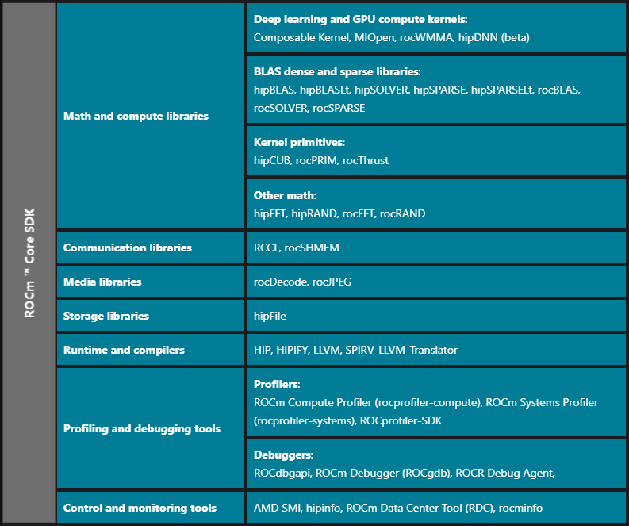
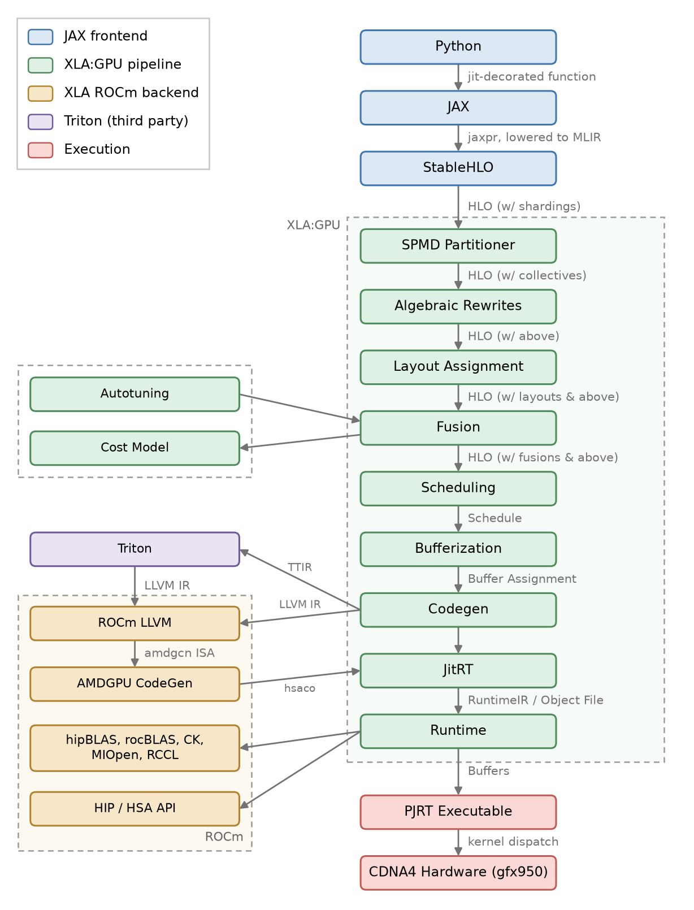
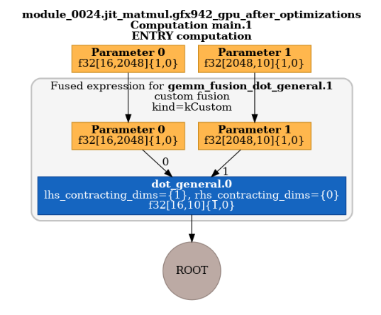
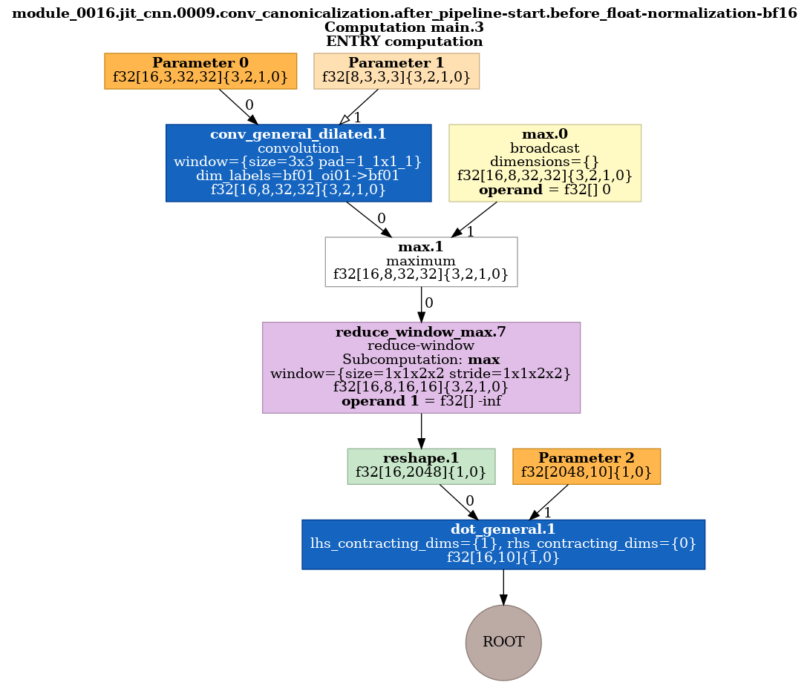
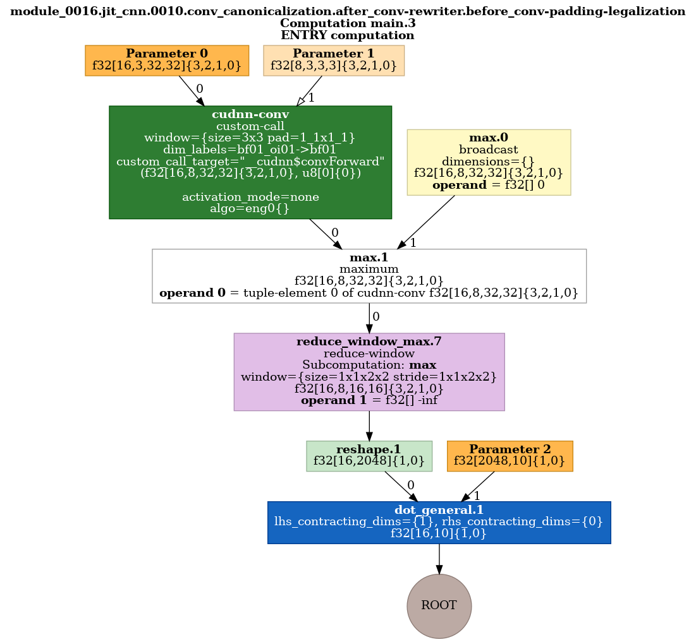

# The ROCm Ecosystem

Before diving into the JAX stack, it helps to know what we're working with on the ROCm side before reaching the framework level. You can find a brief overview [here](https://rocm.docs.amd.com/en/latest/about/what-is-rocm.html).



The most relevent components for us are the math and compute libraries (hipBLAS, rocBLAS, CK, ...) and communication libraries (RCCL), along with the universally useful profiling and debugging tools (rocprof-sdk, rocprof-compute, rocgdb).

> Note that as of ROCm 7.14, AMD has released their own ROCm build platform [TheRock](https://github.com/ROCm/TheRock/tree/main) which enables modular installation of ROCm components through a centralised build manager.

Also note the compiler stack for HIP. ROCm ships its own [LLVM fork](https://rocm.docs.amd.com/projects/llvm-project/en/latest/index.html):

- `amdclang++` (aka HIP-Clang) is the Clang/LLVM-based compiler shipped in the `rocm-llvm` package. It compiles device code into GPU ISA.
- `hipcc` is the driver wrapper. It invokes `amdclang++` with the right HIP include/lib flags.

You generally won't need to write HIP by hand to train a model in JAX. But XLA generates LLVM IR and hands it to this same AMDGPU backend to produce the GPU binary, which we come back to [later](#code-generation).

---

# The JAX/XLA/ROCm Stack

Normally, if you are simply researching and building models in JAX, you may not need to concern yourself with XLA internals. However, if you are looking to extract the maximum performance from a large distributed training/inference workload, it is helpful to look into this and understand what certain XLA performance flags achieve and what parts of the stack they affect.

XLA documents their [GPU backend architecture](https://openxla.org/xla/gpu_architecture) and [how HLO is lowered to binary](https://openxla.org/xla/hlo_to_thunks).



A high-level crash course summary to understand JAX/XLA:

- Jax supports JIT compilation of a function via `jax.jit()`. Commonly used in its decorator form `@jax.jit` around a function.
    - For example:
        ```python
        @jax.jit
        def matmul(a, b):
            return a @ b
        ```
- Jax traces this function and lowers it into the highest form of IR in the stack, `jaxpr`
- `jaxpr` is subequently lowered to `StableHLO` which you can consider a portable, unoptimised representation of the function, or rather, "module" that you have just JIT'd (e.g. `matmul`)
- `StableHLO` is the entry format into the XLA compiler pipeline. From here it is lowered into `HLO` and pipelined through many XLA
optimization stages, some of which are platform specific.
- After this, you have an optimised `HLO` representation of your JIT'd module. It then passes through the XLA backend, where stages such as code generation, op scheduling, and buffer assignment transform the `HLO` into a sequence of executable actions ("Thunks") for the target device.
- By combining thunks with their respective codegen output, you construct the runnable executable.

First, lets see what `StableHLO` and `HLO` actually look like.

---

# What is HLO?

HLO is an intermediate representation. In `.txt` dump format, a single module can look like this:

```
HloModule jit_matmul, entry_computation_layout={(f32[16,2048]{1,0}, f32[2048,10]{1,0})->f32[16,10]{1,0}}

ENTRY %main.1 (a.1: f32[16,2048], b.1: f32[2048,10]) -> f32[16,10] {
  %a.1 = f32[16,2048]{1,0} parameter(0), metadata={op_name="a"}
  %b.1 = f32[2048,10]{1,0} parameter(1), metadata={op_name="b"}
  ROOT %dot_general.1 = f32[16,10]{1,0} dot(%a.1, %b.1), lhs_contracting_dims={1}, rhs_contracting_dims={0}, metadata={op_name="jit(matmul)/dot_general" stack_frame_id=2}
}
```

Not particularly helpful...

But HLO is a DAG (Directed Acyclic Graph) of operations and can be visualized intuitively as such:



- A module can be considered the top-level unit of HLO.
    - if you `jax.jit(matmul)` then `matmul` is your top level operation and hence it is the module.
    - if you `jax.jit(train_step)` then `train_step` is your module, albeit probably magnitudes larger and more complex.
- It follows that `ROOT` is simply the output point of the module.
- `f32[2048,10]{1,0}` represents tensor metadata:
    - `f32` is the datatype
    - `[2048,10]` is the tensor dimensions
    - `{1,0}` is the memory storage format, here indicating row-major as `1` (the row dimension) is listed first.
- `dot_general.1` is an op, namely a dot-product (matmul) op.

Realistically, an HLO module can contain hundreds or thousands of ops. Ultimately, to create the executable, we would like a scheduled sequence of ops to run, ie. to flatten the DAG representation of HLO into a dependency-aware sequence.

# XLA Compiler Components

## HLO Optimisation Passes

The base class representing the XLA GPU pipeline, `gpu_compiler.cc`, defines an entry point `RunHloPasses()` which drives unoptimised HLO to optimised HLO. Passes are grouped into named `HloPassPipeline` objects, each of which is just an ordered list of passes and a runner, ie. `pipeline.Run(module)`.

By specifying XLA compilation flags, you can dump the HLO before and after the entire optimisation pipeline, and you can additionally dump HLO snapshots between a particular pass:
- `--xla_dump_hlo_as_text`: enable HLO dump
- `--xla_dump_to=<DIR>`: specify the dump directory
- `--xla_dump_hlo_pass_re=<REGEX>`: explicitly dump HLO between passes (matches regex of the pass name!)

For example:

```bash
XLA_FLAGS="--xla_dump_to=/tmp/hlo --xla_dump_hlo_as_text --xla_dump_hlo_pass_re=.*" python3 fusion.py
```

```
0004  optimization
0011  layout_assignment
0012  layout_assignment                     after=layout-assignment
0014  AMDGPU_post-layout_assignment_part_1
0018  post-layout_assignment                after=autotuner
0021  AMDGPU_post-layout_assignment_part_2
0024  fusion
0025  fusion                                after=priority-fusion
0035  autotune-fusion-emitters              after=autotuner
0042  scheduled-gpu-module
```

An HLO snapshot is only written when a pass actually changes the module so you may see non-consecutive numbering in the dump.

For example, take this HLO before a `conv-rewriter` pass:


versus after the `conv-rewriter` pass:


`conv_general_dilated.1`, a generic `convolution` op, is lowered to a `custom-call` with target `__cudnn$convForward`. The rest of the graph is untouched. Note that a custom-call is an HLO operation that delegates execution to backend-specific code rather than code generated directly by XLA. Here we are calling into MIOpen for a convolution kernel ("cudnn" due to XLA naming convention).

Broadly speaking, you could group passes roughly by category:

- Graph Optimizations
    - Simplification
    - Fusion
    - Layout optimization
    - Pattern matching

- Lowering
    - Library lowering
    - Backend lowering
    - Code generation

- Runtime
    - Scheduling
    - Memory optimization
    - Distributed execution

---

### Layout assignment

Layout assignment refers to the physical memory arrangement of a tensor's dimensions. `f32[16,2048]{1,0}` is row-major and `{0,1}` would be column-major, and the same idea extends to the 3rd, 4th, Nth dimension. A shape like `[batch, height, width, channel]` alone does not contain information on the stride order in memory.

Aside from the numerous advantages of being aware of this (coalesced vs strided access, cache locality, etc), the HLO optimisation passes can also be divided between pre/post layout assignment:

- Layout-independent passes run first and are valid regardless of memory order: algebraic simplification (`x*1 → x`), constant folding, expanders that decompose high-level ops into primitives, SPMD partitioning.
- Layout-dependent passes run after. Fusion, GEMM rewriting, vendor library matching and Triton fusion all require access patterns, which is known once a layout is pinned per tensor.

In the event of a conflict between layouts (e.g, a tensor op wants {0,1} but the next op wants {1,0}), a full copy op is inserted to perform the required transposition to bridge the ops. This costs a full read, write of the tensor.

---

## Autotuning

A single GEMM has many valid implementations: different rocBLAS/Tensile kernels, different tilings of the work, different MFMA instruction patterns. During compilation the XLA autotuner compiles candidates and empirically measures them.

Autotuning is not free. It costs compile time on every fresh run, and for "small" modules where this cost is not effectively amortized, it may not be worth applying.

```bash
--xla_gpu_autotune_level=4                 # max
--xla_gpu_dump_autotune_results_to=FILE    # persist autotune results
--xla_gpu_load_autotune_results_from=FILE  # load saved autotune data
```

## XLA Scheduler

The XLA scheduler is what transforms the optimised HLO into a planned sequence of ops. The two primary top-level optimization objectives are:

1. Peak memory usage 
    - Buffer lifetimes
    - Buffer reuse
    - Rematerialization/recomputation
    - Eviction/offloading decisions

2. End-to-end latency
    - Exposing parallelism
    - Overlapping communication and compute
    - Critical-path reduction
    - Data locality
    - Resource utilization

At a high level, scheduling can be treated as an optimization problem. Latency-oriented scheduling relies heavily on execution-time estimates, while memory-oriented scheduling relies more on buffer sizes and lifetimes. In both cases, a more accurate cost model enables better scheduling decisions and ultimately a better memory-versus-latency tradeoff.

By default, the XLA scheduler optimises for peak memory usage (ie. first make sure the model actually fits and can therefore run!). 
To optimize scheduling for latency, the recommended XLA flags are:

```bash
--xla_gpu_enable_latency_hiding_scheduler=true
--xla_gpu_enable_command_buffer=''
--xla_disable_hlo_passes=collective-permute-motion
--xla_gpu_experimental_pipeline_parallelism_opt_level=PIPELINE_PARALLELISM_OPT_LEVEL_ENABLE
```

It is recommended to check this against [XLA's documentation for recommended XLA flags](https://docs.jax.dev/en/latest/gpu_performance_tips.html#pipeline-parallelism-on-gpu).

Passes that only make sense once execution order is known live in a separate post-scheduling pipeline (`RunPostSchedulingPipelines`), which is where most collective handling ends up.

## Buffer Assignment

Every HLO value lives in device memory. A naive approach of assigning a unique, non-overlapping buffer per value is wasteful. The buffer assignment process performs liveness analysis, for example, if some value A is dead by the time value B is computed, B can reuse A's memory. The result is a memory plan mapping each value to an offset within a set of allocations. You can imagine this is in concept similar to traditional CPU stack allocation, but applied to GPU HBM.

It runs after scheduling as lifetimes depend on execution order.

## Code Generation

For every op in the optimised module, XLA lowers through one of these ROCm backend paths:

1. a vendor library, expressed as a `custom-call` (rocBLAS/hipBLAS GEMM, MIOpen convolution, RCCL collective)
2. Triton, for fusions built around a dot or a softmax-shaped reduction
3. XLA emitter

The XLA emitter uses an LLVM backend. An emitter consumes an HLO fusion and emits IR, ie. `HloFusion → [Emitter] → MLIR → [MLIR lowering passes] → LLVM IR → amdgcn ISA`. Vendor library `custom-call`s and Triton can both be considered offloading to an external "black-block", the output from which is the final kernel.

The dump gives you the IR at both ends of the LLVM pipeline (`.ir-no-opt.ll`, `.ir-with-opt.ll`). For a fused elementwise chain, `jnp.exp(a * b + c)`, which XLA lowers to a single `kLoop` fusion:

```llvm
target triple = "amdgcn-amd-amdhsa"

define amdgpu_kernel void @loop_exponential_fusion(ptr noalias align 16 dereferenceable(268435456) %0, ...) {
  %18 = fmul float %16, %17
  %20 = fadd float %18, %19
  %21 = call float @llvm.exp.f32(float %20)
  ...
```

The target is `amdgcn-amd-amdhsa`, so from this point down it is the same AMDGPU backend that `amdclang++` drives.

---

# ROCm Backends

- `rocBLAS`/`hipBLAS` for GEMMs, via `custom-call`
- `MIOpen` for convolutions
- `RCCL` for collectives
- `Triton` for dot-shaped fusions

## [WIP] JAX-AITER

[`jax-aiter`](https://github.com/ROCm/jax-aiter) AITER's hand-tuned AMD kernels into XLA as FFI calls.

[JAX AITER blog post](https://rocm.blogs.amd.com/software-tools-optimization/jax-aiter/README.html)

---

# The Runtime

## Thunks and StreamExecutor

The executable is ultimately a sequence of thunks, ie. a `vector<Thunk>`. A thunk is "one runtime action", e.g. launch kernel K, or do a memcpy, or run a collective. It is not the kernel itself. Execution is then not much more than:

```cpp
for (Thunk& thunk : thunk_sequence)
    thunk.ExecuteOnStream(params);   // params.stream from setup
```

The `ThunkSequence` is the program's view of the executable, and the stream is the closer-to-hardware view of what actually runs:

```
ThunkSequence              Stream
(vector<Thunk>)            (ordered queue of driver ops)
─────────────              ────────────────────────────
kGemm       ─executes─▶    [rocBLAS internally enqueues N kernel launches]
kCopy       ─executes─▶    [Memcpy]
kKernel     ─executes─▶    [LaunchKernel]
kAllReduce  ─executes─▶    [RCCL enqueues kernels + comms]
```

> The `k` in `kKernel` is just Google's naming convention for a constant.

`xla/stream_executor/` is the hardware abstraction underneath. One `StreamExecutor` represents one GPU, and its methods are device-driver primitives:

- `Allocate` / `HostMemoryAllocate`, which is what the buffer assignment plan ultimately calls into
- `CreateStream`, `CreateEvent` for execution queues and sync points
- `LoadModule` / `LoadKernel` to load the compiled hsaco and get a launchable kernel handle
- `SynchronousMemcpy`, `SynchronizeAllActivity` for host-device transfer and sync
- `CreateCommandBuffer`, the HIP graph equivalent, which replaces a run of per-thunk launches with one graph launch and so reduces host dispatch cost

## PJRT

PJRT is an API defined by XLA that a backend has to implement. It is deliberately opaque and vendor agnostic. This decoupled nature means that JAX interacts only through the PJRT, as oppose to any vendor specific interace e.g. HIP.

Here is a contrived example of how this looks:

1. XLA defines the interface:

```cpp
class PjRtClient {
    virtual std::unique_ptr<PjRtBuffer> BufferFromHost(const void* data, size_t bytes) = 0;
    virtual std::unique_ptr<PjRtLoadedExecutable> LoadExecutable(const std::string& binary) = 0;
};
```

2. ROCm provides the platform-specific implementation (HIP):

```cpp
std::unique_ptr<PjRtBuffer> RocmClient::BufferFromHost(const void* data, size_t bytes) {
    void* dev_ptr;
    hipMalloc(&dev_ptr, bytes);
    hipMemcpy(dev_ptr, data, bytes, hipMemcpyHostToDevice);
    return std::make_unique<RocmBuffer>(dev_ptr, bytes);
}

std::unique_ptr<PjRtLoadedExecutable> RocmClient::LoadExecutable(const std::string& hsaco) {
    hipModule_t module;
    hipFunction_t kernel;
    hipModuleLoadData(&module, hsaco.data());        // the binary XLA codegen produced
    hipModuleGetFunction(&kernel, module, "fused_kernel");
    return std::make_unique<RocmExecutable>(kernel);
}
```

3. The PJRT interface is called, unaware of the backend implementation:

```cpp
auto executable = client->LoadExecutable(compiled_binary);
auto a = client->BufferFromHost(a_data, bytes);
auto b = client->BufferFromHost(b_data, bytes);
executable->Execute({a.get(), b.get()});
```

---

# XLA Compiler Performance Flags

Flags are declared in `xla/debug_options_flags.cc`. There are several hundred of them, and they are set through the `XLA_FLAGS` environment variable.

E.g. from the shell:
```bash
XLA_FLAGS="--xla_gpu_autotune_level=4 --xla_dump_to=/tmp/hlo" python3 train.py
```

Or in Python:
```python
import os
os.environ["XLA_FLAGS"] = (
    "--xla_gpu_enable_latency_hiding_scheduler=true "
    "--xla_dump_to=/tmp/hlo"
)
import jax  # must come after
```

Each dumped module comes with a `.debug_options` file that lists the effective options that reached the module (eg. if unsure whether certain flags were silently dropped, or added by a third party framework like Maxtext).

The ones used in this chapter:

```bash
--xla_dump_to=DIR                         # HLO, LLVM IR, thunks, buffer plan
--xla_dump_hlo_as_text                    # .txt modules
--xla_dump_hlo_as_dot                     # .dot graphs, render with graphviz
--xla_dump_hlo_pass_re=.*                 # a snapshot around every pass
--xla_disable_hlo_passes=PASS             # turn a named pass off
--xla_gpu_autotune_level=0                # disable autotuning
--xla_gpu_enable_triton_gemm=false        # prefer the library GEMM path
```

For a list of recommended performance flags on AMD hardware, see [ROCm's JAX flag reference](https://rocm.docs.amd.com/projects/cvs/en/latest/reference/configuration-files/jax.html#xla-flags).
